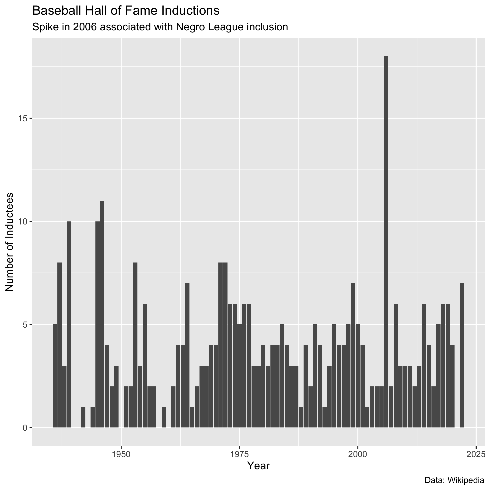

```{r setup, include=FALSE}
knitr::opts_chunk$set(echo = FALSE)

# Learn more about creating websites with Distill at:
# https://rstudio.github.io/distill/website.html

# Learn more about publishing to GitHub Pages at:
# https://rstudio.github.io/distill/publish_website.html#github-pages
library(rvest)
library(janitor)
library(tidyverse)
library(knitr)
```

```{r get_data}
# GadgetSelector is still a mystery to me. I just guessed that "table" would
# work. Not sure if something like "td" would be different and/or better. Would
# be nice to specify the exact table I want, rather than getting 6 of them.

all_tables <- "https://en.wikipedia.org/wiki/List_of_members_of_the_Baseball_Hall_of_Fame" |> 
  read_html() |> 
  html_elements("table") |> 
  html_table()
```

```{r plot_data}

```


